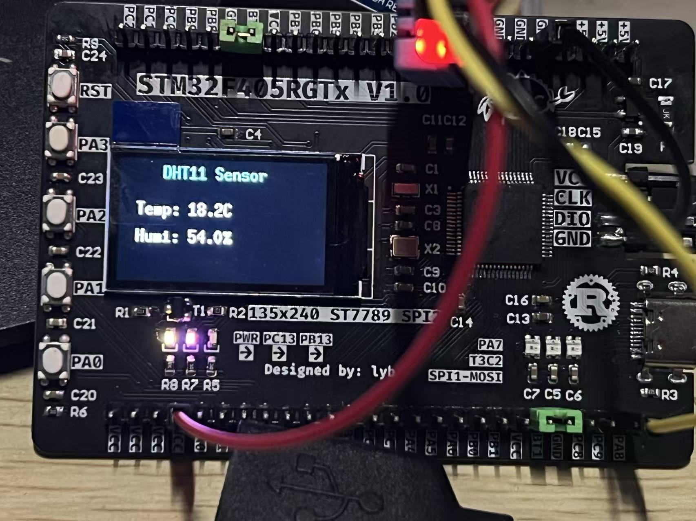

This is a SIMPLE DEMO for DHT11 MODULE，using `FLEX+DWT`.

I ALREADY tested it on STM32F405RGT6@168MHz and STM32F103C8T6@72MHz, and all the results just fit my will.

Besides, dislpaying the data read from DHT11 on a ST7789 screeen is also tested OK.

ALL the codes written by `Claude`. U should `CHECK` the source code before applying it to any of your projects.

ENJOY...
